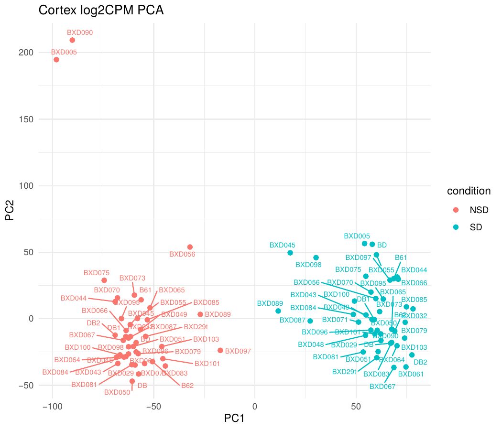
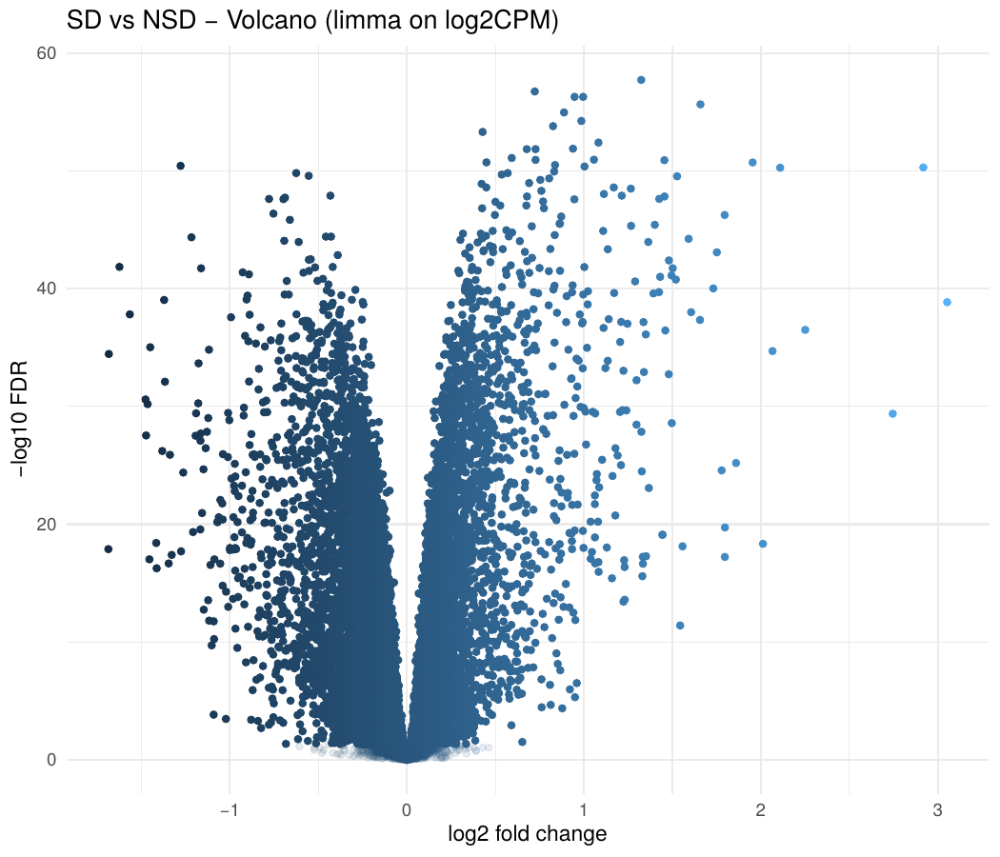
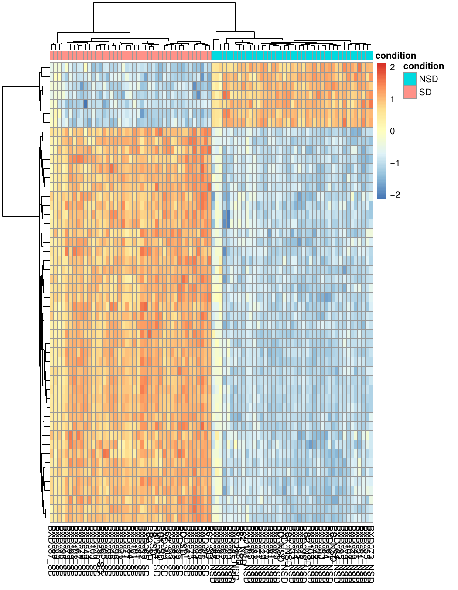
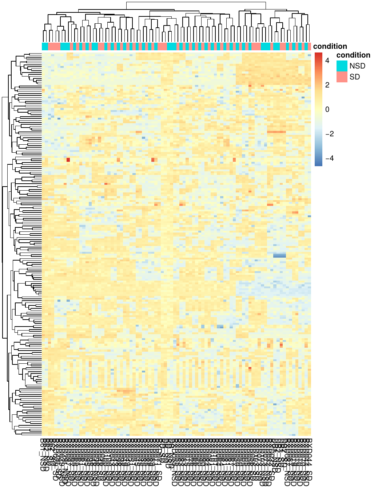

# 🌙 Cortex Sleep Deprivation Transcriptomics Analysis

RNA-seq differential expression and functional enrichment analysis of mouse cortex under sleep deprivation, completed in collaboration with the **Hogenesch Lab** ("Clocks group"), Division of Human Genetics, **Cincinnati Children's Hospital Medical Center (CCHMC)**.

## Overview

This project reanalyzes public RNA-seq data comparing sleep-deprived (SD) and non-sleep-deprived (NSD) mouse cortex, to characterize the transcriptional response to acute sleep loss. The work was done as an independent analysis project with guidance from Dr. John Hogenesch and lab manager Jiffin Paulose at CCHMC.

## Dataset

- **Source:** [GSE114845](https://www.ncbi.nlm.nih.gov/geo/query/acc.cgi?acc=GSE114845) (Gene Expression Omnibus)
- **Tissue:** Mouse cortex
- **Design:** Sleep-deprived (SD) vs. non-sleep-deprived (NSD), n = 86 samples (43 per condition)
- **Reference:** [Ingiosi et al., *PLoS Biology*](https://journals.plos.org/plosbiology/article?id=10.1371/journal.pbio.2005750)

## Methods

1. Downloaded processed log2-CPM expression matrices directly from GEO and merged the NSD and SD sample sets.
2. Normalization, PCA, and QC heatmaps to confirm samples cluster cleanly by condition.
3. Differential expression with **limma**, using mouse strain as a blocking factor (`duplicateCorrelation`).
4. Gene annotation via **org.Mm.eg.db**, followed by GO Biological Process enrichment with **clusterProfiler**.

Full R session and package versions are in [`sessionInfo.txt`](./sessionInfo.txt) (R 4.5.1; key packages: limma 3.66.0, clusterProfiler 4.18.1, GEOquery 2.78.0, org.Mm.eg.db 3.22.0, pheatmap, ggrepel, tidyverse).

> **Note:** the original analysis script is not yet included in this repo (in progress). Results below were generated from that pipeline; a cleaned-up script will be added.

## Key Results

- **≈11,300 genes** significant at FDR < 0.05, indicating a broad cortical transcriptional response to sleep deprivation.
- Strong, consistent **upregulation of ER-stress / unfolded-protein-response (UPR)** genes under sleep deprivation, among the most significant hits genome-wide:

  | Gene | log2FC | FDR |
  |---|---|---|
  | Hspa5 | 1.324 | 1.84e-58 |
  | Sdf2l1 | 1.659 | 2.19e-56 |
  | Manf | 0.996 | 5.07e-57 |
  | Pdia6 | 0.948 | 5.07e-57 |
  | Calr | 0.826 | 1.56e-54 |
  | Xbp1 | 0.727 | 1.39e-52 |
  | Hyou1 | 0.723 | 1.76e-57 |

  (full ranked list in [`results/tables/Top30_SD_vs_NSD_for_email.csv`](./results/tables/Top30_SD_vs_NSD_for_email.csv))

- Notable outliers: **Arc** (log2FC +2.92, immediate-early gene) strongly induced by sleep deprivation; **Cirbp** (log2FC -1.28, a core circadian cold-inducible RNA-binding protein) downregulated.
- **Top enriched GO Biological Process terms** (by adjusted p-value):

  | GO term | Description | p.adjust | Genes |
  |---|---|---|---|
  | GO:0050678 | Regulation of epithelial cell proliferation | 1.1e-07 | 83 |
  | GO:0001666 | Response to hypoxia | 1.1e-07 | 70 |
  | GO:0042060 | Wound healing | 1.4e-06 | 78 |
  | GO:0048545 | Response to steroid hormone | 1.5e-06 | 70 |
  | GO:1903706 | Regulation of hemopoiesis | 1.5e-06 | 82 |
  | GO:0036293 | Response to decreased oxygen levels | 1.5e-06 | 71 |
  | GO:0031960 | Response to corticosteroid | 1.7e-06 | 43 |
  | GO:0048511 | Rhythmic process | 5.6e-06 | 66 |

  (full table in [`results/tables/GO_enrichment_BP_SD_vs_NSD.csv`](./results/tables/GO_enrichment_BP_SD_vs_NSD.csv))

- Together, these patterns suggest sleep deprivation activates a **stress-response and metabolic remodeling program** in cortex, layered on top of hypoxia-response, steroid-hormone, and circadian/rhythmic signaling.

## Figures

**PCA of log2-CPM expression** (samples colored by condition)



**Volcano plot, SD vs. NSD**



**Heatmap, top 50 genes by FDR**



**Heatmap, top 200 most variable genes**



Full-resolution, print-quality PDFs of all four figures are in [`results/figures/`](./results/figures/).

## Repository Structure

```text
.
├── README.md
├── sessionInfo.txt
├── results/
│   ├── tables/
│   │   ├── Cortex_SD_vs_NSD_limma_log2CPM_annot.csv   # full DE results
│   │   ├── Top30_SD_vs_NSD_for_email.csv              # top 30 DE genes
│   │   └── GO_enrichment_BP_SD_vs_NSD.csv             # GO BP enrichment
│   └── figures/
│       ├── PCA_log2CPM_cortex.pdf
│       ├── Volcano_SD_vs_NSD.pdf
│       ├── Heatmap_top50_FDRgenes.pdf
│       ├── Heatmap_top200_var_genes.pdf
│       └── png/                                       # PNG previews, embedded above
│           ├── PCA_log2CPM_cortex.png
│           ├── Volcano_SD_vs_NSD.png
│           ├── Heatmap_top50_FDRgenes.png
│           └── Heatmap_top200_var_genes.png
└── scripts/                                            # analysis script(s), coming soon
```

## 🌷 Acknowledgments

This analysis was completed in collaboration with the **Hogenesch Lab**, Division of Human Genetics, Cincinnati Children's Hospital Medical Center, with guidance from Dr. John Hogenesch and Jiffin Paulose. Data originally generated by Ingiosi et al. and deposited to GEO as GSE114845.

## ✨ Author

Hera Dashnyam ([GitHub](https://github.com/MaralguaDashnyam))
